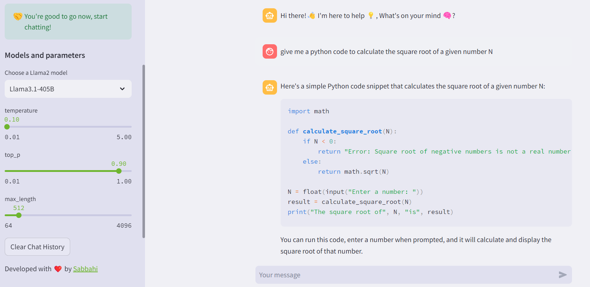

# Llama 3.1 Chatbot

This repository contains a Streamlit application for a chatbot powered by the [Llama3.1-405B](https://replicate.com/meta/meta-llama-3.1-405b-instruct) LLM from Meta, hosted on the [Replicate platform](https://replicate.com). The application includes configuration files, application code, and dependencies required to run the chatbot. Additionally, I have integrated the [Llama3-8B](https://replicate.com/meta/meta-llama-3-8b) and [Llama3-70B](https://replicate.com/meta/meta-llama-3-70b) LLMs, allowing you to interact with them as well.

You can try it live at this link: [llama3-1-chatbot](https://llama3-1-chatbot.streamlit.app).




## Getting Started

Follow these instructions to set up and run the project on your local machine.

### Prerequisites

- Python 3.12
- Streamlit
- replicate

### Installation

1. **Clone the repository:**

    ```bash
    git clone https://github.com/amine-sabbahi/llama3.1-chatbot.git
    cd llama3.1-chatbot
    ```

2. **Install the dependencies:**

    ```bash
    pip install -r requirements.txt
    ```

3. **Install the dependencies:**

    ```bash
    streamlit run app.py
    ```

### Configuration

1. **Edit the Streamlit configuration files:**

    - `.streamlit/config.toml`: Here you can customize your Streamlit app theme.
    - `.streamlit/secrets.toml`: You can add your replicate api key in here.


## Usage

Once the application is running, you can interact with the Llama 3.1 Chatbot through the Streamlit interface.
you will just need a replicate api key that you can get from [here](https://replicate.com/account/api-tokens)


## Contact

If you have any questions or suggestions, please feel free to contact [me](https://github.com/amine-sabbahi).
